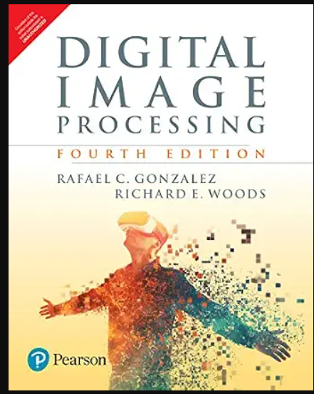

# Digital Image Processing — Gonzalez & Woods (4th Edition)

<p align="center">
  
</p>

Hands-on implementation of **_Digital Image Processing_, 4th Edition, by Rafael C. Gonzalez & Richard E. Woods (Pearson, 2018)**, chapter by chapter, in Python. Each concept is first written from scratch in NumPy, then checked against OpenCV / scikit-image, and finally connected to its deep learning version in PyTorch.

> Goal: build a solid foundation in classical image processing before moving into deep learning for computer vision.

> **Edition note:** This repo follows the **13-chapter 4th edition** (Pearson India reprint of the US edition, pictured above), where segmentation is split into Chapters 10 and 11. The Global Edition has 12 chapters, swaps Chapters 6 and 7, and merges segmentation into one chapter.

---

## 📚 Table of Contents

- [Course Roadmap](#️-course-roadmap)
- [Repository Structure](#-repository-structure)
- [Setup](#️-setup)
- [Chapter Breakdown](#-chapter-breakdown)
- [Classical → Deep Learning Bridge](#-classical--deep-learning-bridge)
- [Datasets & Test Images](#️-datasets--test-images)
- [Progress Tracker](#-progress-tracker)
- [Mini-Projects](#-mini-projects)
- [References](#-references)

---

## 🗺️ Course Roadmap

```
Ch1 Intro ──► Ch2 Fundamentals ──► Ch3 Spatial Filtering ──► Ch4 Frequency Domain
                                                                     │
                                                                     ▼
Ch8 Compression ◄── Ch7 Color ◄── Ch6 Wavelets & Transforms ◄── Ch5 Restoration
      │
      ▼
Ch9 Morphology ──► Ch10 Segmentation I ──► Ch11 Segmentation II (Active Contours)
                                                                     │
                                                                     ▼
                              Ch13 Pattern Classification (CNNs) ◄── Ch12 Feature Extraction
```

---

## 📁 Repository Structure

```
DigitalImageProcessing/
├── README.md
├── requirements.txt
├── assets/
│   └── cover.png            # Book cover shown in this README
├── data/
│   ├── images/              # Book and standard test images
│   └── outputs/             # Generated results
├── utils/
│   ├── io.py                # Load / save / display helpers
│   ├── metrics.py           # MSE, PSNR, SSIM
│   └── plotting.py          # Side-by-side comparisons, histograms
├── ch01_introduction/
├── ch02_fundamentals/
├── ch03_intensity_spatial_filtering/
├── ch04_frequency_domain/
├── ch05_restoration_reconstruction/
├── ch06_wavelets_transforms/
├── ch07_color/
├── ch08_compression_watermarking/
├── ch09_morphology/
├── ch10_segmentation_I/
├── ch11_segmentation_II_active_contours/
├── ch12_feature_extraction/
├── ch13_pattern_classification/
└── projects/                # Mini-projects that combine several chapters
```

Each chapter folder uses the same layout:

```
chXX_topic/
├── notes.md                 # Key concepts, equations, intuition
├── from_scratch.ipynb       # NumPy-only implementations
├── library_compare.ipynb    # OpenCV / scikit-image equivalents
└── exercises/               # Solutions to selected end-of-chapter problems
```

---

## ⚙️ Setup

```bash
git clone https://github.com/prasannabalki/DigitalImageProcessing.git
cd DigitalImageProcessing

python -m venv .venv
source .venv/bin/activate        # Windows: .venv\Scripts\activate

pip install -r requirements.txt
```

**requirements.txt**

```
numpy
scipy
matplotlib
opencv-python
scikit-image
pywavelets
pillow
jupyter
torch
torchvision
```

---

## 📖 Chapter Breakdown

### Chapter 1 — Introduction
- What digital image processing is; origins and application areas
- Imaging across the EM spectrum (gamma, X-ray, UV, visible, IR, microwave, radio)
- Fundamental steps and components of an image processing system

### Chapter 2 — Digital Image Fundamentals
- Elements of visual perception; light and the EM spectrum
- Image sensing and acquisition; a simple image formation model
- Sampling and quantization; spatial and intensity resolution
- Image interpolation (nearest, bilinear, bicubic)
- Basic pixel relationships: neighbors, adjacency, connectivity, distance measures
- Mathematical tools: arithmetic, set, logical, spatial and geometric operations, image registration, image transforms, probability

**Implement:** resampling, interpolation from scratch, affine transforms, quantization effects

### Chapter 3 — Intensity Transformations & Spatial Filtering
- Negatives, log, power-law (gamma), piecewise-linear transforms
- Histogram processing: equalization, matching (specification), local histogram processing, histogram statistics
- Fundamentals of spatial filtering: correlation, convolution, separable kernels
- Smoothing (lowpass) spatial filters: box, Gaussian, order-statistic (median)
- Sharpening (highpass) spatial filters: Laplacian, unsharp masking, high-boost, gradient (Sobel)
- Highpass, bandreject and bandpass filters built from lowpass kernels
- Combining spatial enhancement methods

**Implement:** 2D convolution from scratch, histogram equalization and matching, unsharp masking

### Chapter 4 — Filtering in the Frequency Domain
- Fourier series, Fourier transform, sampling theorem, aliasing
- 2D DFT and its properties; FFT
- Frequency-domain filtering basics
- Lowpass filters: ideal, Butterworth, Gaussian
- Highpass filters, frequency-domain Laplacian, unsharp masking, homomorphic filtering
- Selective filtering: bandreject, bandpass, notch filters

**Implement:** DFT vs FFT comparison, a frequency-domain filtering pipeline, notch filtering of periodic noise

### Chapter 5 — Image Restoration & Reconstruction
- Degradation/restoration model; noise models (Gaussian, Rayleigh, Erlang, exponential, uniform, salt-and-pepper)
- Restoration in the presence of noise only: mean, order-statistic, adaptive filters
- Periodic noise reduction using frequency-domain filtering
- Linear, position-invariant degradations; estimating the degradation function
- Inverse filtering, Wiener filtering, constrained least squares, geometric mean filter
- Image reconstruction from projections (Radon transform, filtered back-projection, CT)

**Implement:** noise generators, adaptive median filter, Wiener deconvolution, filtered back-projection

### Chapter 6 — Wavelet & Other Image Transforms
- Matrix-based transforms; correlation; basis functions in the time-frequency plane; basis images
- Fourier-related transforms: DFT, discrete Hartley, discrete cosine (DCT), discrete sine
- Walsh-Hadamard, slant and Haar transforms
- Wavelet transforms: multiresolution analysis, wavelet series, discrete and fast wavelet transforms, 2D wavelets, wavelet packets

**Implement:** DCT from scratch, 2D Haar wavelet decomposition, wavelet denoising

### Chapter 7 — Color Image Processing
- Color fundamentals; color models: RGB, CMY(K), HSI, device-independent color (CIE L\*a\*b\*)
- Pseudocolor image processing
- Basics of full-color image processing
- Color transformations: complements, color slicing, tone and color corrections, histogram processing of color images
- Color image smoothing and sharpening
- Using color in image segmentation
- Noise in color images; color image compression

**Implement:** RGB ↔ HSI conversion, color slicing, color-based segmentation

### Chapter 8 — Image Compression & Watermarking
- Fundamentals: coding, spatial/temporal and irrelevant redundancy; measuring image information (entropy); fidelity criteria
- Image formats, containers and compression standards
- Huffman, Golomb, arithmetic, LZW, run-length, symbol-based and bit-plane coding
- Block transform coding (JPEG pipeline)
- Predictive coding (lossless and lossy)
- Wavelet coding
- Digital image watermarking

**Implement:** Huffman coder, mini-JPEG (DCT + quantization + zigzag + entropy coding), a simple invisible watermark

### Chapter 9 — Morphological Image Processing
- Erosion, dilation, opening, closing
- Hit-or-miss transform
- Basic morphological algorithms: boundary extraction, hole filling, connected components, convex hull, thinning, thickening, skeletons, pruning
- Morphological reconstruction
- Summary of morphological operations on binary images
- Grayscale morphology: top-hat, bottom-hat, granulometry, textural segmentation

**Implement:** binary morphology from scratch, skeletonization, top-hat correction for uneven illumination

### Chapter 10 — Image Segmentation I: Edge Detection, Thresholding & Region Detection
- Point, line and edge detection; image gradient; Marr-Hildreth and Canny edge detectors
- Linking edge points (local processing, regional processing, Hough transform)
- Thresholding: global, Otsu's optimum method, smoothing and edges to improve thresholding, multiple and variable thresholds
- Segmentation by region growing and by region splitting and merging
- Region segmentation using clustering (k-means) and superpixels
- Region segmentation using graph cuts
- Segmentation using morphological watersheds
- Use of motion in segmentation

**Implement:** Canny from scratch, Otsu's method, Hough lines, SLIC superpixels, watershed segmentation

### Chapter 11 — Image Segmentation II: Active Contours (Snakes & Level Sets)
- Background and motivation for active contours
- Snakes: explicit curve representation, energy functional, external forces, gradient vector flow (GVF)
- Level sets: implicit curve representation, evolution equation, curvature, discrete implementation
- Edge-based vs region-based (Chan-Vese style) level-set formulations
- Practical considerations: initialization, reinitialization, stopping criteria

**Implement:** classic snake from scratch, GVF snake, a Chan-Vese level-set segmenter; compare with `skimage.segmentation.active_contour` and `chan_vese`

### Chapter 12 — Feature Extraction
- Background; boundary preprocessing (boundary following, chain codes, polygonal approximation, signatures, skeletons)
- Boundary feature descriptors: shape numbers, Fourier descriptors, statistical moments
- Region feature descriptors: topological, texture (statistical, GLCM, spectral), moment invariants
- Principal components as feature descriptors
- Whole-image features: Harris-Stephens corner detector, MSER
- Scale-invariant feature transform (SIFT)

**Implement:** chain codes, Fourier descriptors, Hu moments, GLCM texture features, Harris corners, SIFT matching

### Chapter 13 — Image Pattern Classification
- Patterns and pattern classes
- Pattern classification by prototype matching: minimum-distance, correlation, matching structural prototypes
- Optimum (Bayes) statistical classifiers
- Neural networks and deep learning: perceptrons, multilayer feedforward networks, backpropagation
- Deep convolutional neural networks: architecture, training, examples
- Some additional details of implementation

**Implement:** minimum-distance and Bayes classifiers, an MLP with backprop in NumPy, a CNN in PyTorch on MNIST / CIFAR-10

---

## 🔗 Classical → Deep Learning Bridge

| Classical concept (4th Ed.) | Deep learning counterpart |
|---|---|
| Spatial convolution, filter kernels (Ch 3) | Conv layers with learned kernels |
| Smoothing / downsampling (Ch 2–3) | Pooling, strided convolutions |
| Frequency domain (Ch 4) | FFT-based convolutions, Fourier neural operators |
| Restoration, Wiener filtering (Ch 5) | Denoising autoencoders, DnCNN, deblurring networks |
| Wavelets, multiresolution (Ch 6) | Feature pyramids (FPN), wavelet-CNNs |
| Color spaces (Ch 7) | Input normalization, colorization networks |
| Compression (Ch 8) | Learned image compression, autoencoders |
| Morphology (Ch 9) | Post-processing of segmentation masks |
| Edges, thresholding, regions (Ch 10) | U-Net, Mask R-CNN, SAM |
| Active contours, level sets (Ch 11) | Deep active contours, level-set losses, boundary-aware losses |
| Hand-crafted features: SIFT, HOG, GLCM (Ch 12) | Learned CNN / ViT embeddings |
| Pattern classification (Ch 13) | CNNs, ResNets, Vision Transformers |

---

## 🖼️ Datasets & Test Images

- **Book images:** [imageprocessingplace.com](https://www.imageprocessingplace.com) (official companion site for the book)
- **USC-SIPI Image Database:** classic test images
- **scikit-image built-ins:** `skimage.data` (camera, coins, astronaut, etc.)
- **For the deep learning chapter:** MNIST, Fashion-MNIST, CIFAR-10 via `torchvision.datasets`

---

## ✅ Progress Tracker

| # | Chapter | Notes | From Scratch | Library Compare | Exercises |
|---|---|:-:|:-:|:-:|:-:|
| 1 | Introduction | ⬜ | — | — | ⬜ |
| 2 | Digital Image Fundamentals | ⬜ | ⬜ | ⬜ | ⬜ |
| 3 | Intensity Transformations & Spatial Filtering | ⬜ | ⬜ | ⬜ | ⬜ |
| 4 | Filtering in the Frequency Domain | ⬜ | ⬜ | ⬜ | ⬜ |
| 5 | Image Restoration & Reconstruction | ⬜ | ⬜ | ⬜ | ⬜ |
| 6 | Wavelet & Other Image Transforms | ⬜ | ⬜ | ⬜ | ⬜ |
| 7 | Color Image Processing | ⬜ | ⬜ | ⬜ | ⬜ |
| 8 | Image Compression & Watermarking | ⬜ | ⬜ | ⬜ | ⬜ |
| 9 | Morphological Image Processing | ⬜ | ⬜ | ⬜ | ⬜ |
| 10 | Image Segmentation I | ⬜ | ⬜ | ⬜ | ⬜ |
| 11 | Image Segmentation II: Active Contours | ⬜ | ⬜ | ⬜ | ⬜ |
| 12 | Feature Extraction | ⬜ | ⬜ | ⬜ | ⬜ |
| 13 | Image Pattern Classification | ⬜ | ⬜ | ⬜ | ⬜ |

Legend: ⬜ Not started · 🟨 In progress · ✅ Done

---

## 🧪 Mini-Projects

1. **Document scanner** — edge detection + perspective transform + adaptive thresholding (Ch 2, 3, 10)
2. **Medical image enhancement** — histogram processing + restoration on X-ray / MRI slices (Ch 3, 5)
3. **Cell counting** — thresholding + morphology + connected components (Ch 9, 10)
4. **Organ / tumor boundary tracing** — level-set segmentation on medical images (Ch 11)
5. **Mini-JPEG codec** — DCT, quantization, entropy coding, PSNR vs compression ratio (Ch 6, 8)
6. **Classical vs CNN classifier** — SIFT/GLCM features + SVM vs a small CNN on the same dataset (Ch 12, 13)

---

## 📚 References

- Gonzalez, R. C., & Woods, R. E. *Digital Image Processing*, 4th Ed., Pearson, 2018.
- Gonzalez, R. C., Woods, R. E., & Eddins, S. L. *Digital Image Processing Using MATLAB*, 3rd Ed.
- Book companion site and DIP4E support packages: https://www.imageprocessingplace.com
- Szeliski, R. *Computer Vision: Algorithms and Applications*, 2nd Ed. (free online)
- Goodfellow, I., Bengio, Y., & Courville, A. *Deep Learning*, MIT Press.
- OpenCV docs: https://docs.opencv.org
- scikit-image docs: https://scikit-image.org/docs

---

## 📄 License

Code in this repository is released under the MIT License. Book content, figures and problem statements remain the copyright of the authors and Pearson; this repo contains only original notes and implementations.
